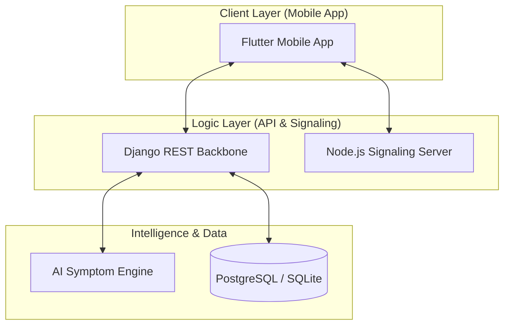

# Rural Healthcare Connectivity Platform 🏥

An integrated healthcare ecosystem designed to bridge the gap between rural communities and medical professionals using AI-driven diagnostics and real-time telemedicine.

---

## 1. Project Overview
The goal of this project is to improve access to healthcare in rural areas by connecting patients, doctors, and ASHA (Accredited Social Health Activist) workers through a high-performance mobile application. The platform focuses on **reliability**, **offline accessibility**, and **triage-first** medical care.


---

## 2. System Architecture
The system follows a distributed micro-modular architecture for maximum availability.



---

## 3. Tech Stack
| Component | Technology | Purpose |
| :--- | :--- | :--- |
| **Frontend** | **Flutter / Dart** | Cross-platform mobile UX. |
| **Backend** | **Django / DRF** | Scalable API & User management. |
| **Database** | **SQLite / PostgreSQL** | Local & Cloud data persistence. |
| **AI / ML** | **Python (Scikit-learn)** | Predictive health analytics. |
| **RTC** | **WebRTC / Socket.io** | Low-latency video consultations. |
| **Maps** | **OpenStreetMap API** | Geographic clinic discovery. |

---

## 4. Main Features

### 👤 User Module
*   **AI Symptom Checker**: Preliminary triage using machine learning.
*   **Medicine Tracker**: Automated reminders for medicine dosage.
*   **Nearby Healthcare**: Map-based clinic and hospital discovery.
*   **Doctor Consultation**: Real-time video/audio calling.

### 🩺 Doctor Module
*   **Patient Management**: Centralized dashboard for village patients.
*   **Digital Prescriptions**: Rapid creation and delivery of medical advice.
*   **Video Consultation**: Full-featured WebRTC calling (mute, toggle camera, etc.).

### 👩‍⚕️ ASHA Worker Module
*   **Patient Monitoring**: Tracking health metrics of village members.
*   **Village Health Alerts**: Proactive notifications for high-risk patients.
*   **Bridge Communication**: Relaying data between doctors and local patients.

---

## 5. Database Models (Core)

### User Model
```python
class User(AbstractUser):
    ROLE_CHOICES = (('user', 'User'), ('doctor', 'Doctor'), ('asha_worker', 'ASHA'))
    phone_number = models.CharField(max_length=15, unique=True)
    role = models.CharField(max_length=20, choices=ROLE_CHOICES)
    village = models.CharField(max_length=100)
```

### Doctor Model
```python
class Doctor(models.Model):
    user = models.OneToOneField(User, on_delete=models.CASCADE)
    specialization = models.CharField(max_length=100)
    hospital_name = models.CharField(max_length=200)
    experience_years = models.IntegerField()
```

---

## 6. Primary API Endpoints

| Category | Endpoint | Method | Result |
| :--- | :--- | :--- | :--- |
| **Auth** | `/api/auth/login/` | `POST` | Get JWT/Session token |
| **Doctors** | `/api/users/doctors/` | `GET` | List all available doctors |
| **Consult** | `/api/consultations/start/` | `POST` | Initiate a medical session |
| **Prescribe**| `/api/prescriptions/` | `POST` | Save medical advice |

---

## 7. AI Symptom Analysis (actual ML)

**Yes — real scikit-learn ML is used.** Not a dummy calculator, and not ChatGPT / LLM.

| Piece | What it is |
|---|---|
| Algorithm | `sklearn.ensemble.RandomForestClassifier` (`n_estimators=120`) |
| Dataset | `mobile_app/lib/dataset/disease/dataset.csv` (~4920 rows, ~131 symptoms, ~41 diseases) |
| Artifact | `ai_engine/models/trained_model.pkl` (`model`, `features`, `LabelEncoder`, `accuracy`) |
| Disease | ML: multi-hot symptom vector → `predict_proba` |
| Severity | **Rules**, not ML (`SEVERITY_MAP` in `ai_engine/predict.py`) |
| Fallback | If pickle fails: CSV symptom-overlap scoring |

**Path:** Patient Symptom Checker → `POST /api/symptoms/analyze/` → Django `SymptomAnalysisView` (Hindi word map) → `ai_engine.predict.predict_symptoms`. High/Critical results create an `AlertNotification` for the village ASHA + a doctor.

This is **screening, not diagnosis**. Doctor and ASHA symptom text fields do not call the model.

---

## 7b. Module workflows (live vs dummy)

Village link: `User.village` == `ASHAWorker.assigned_village`.

**Patient (live):** login/OTP, AI checker, medicines, doctor video/audio, prescriptions, village ASHA card, emergency Notify ASHA.  
**Patient (placeholder):** health tips, some settings/profile routes, mock clinic ratings.

**Doctor (live):** Home/Patients/Schedule/Profile tabs, patients API, outbound/inbound WebRTC, prescriptions, history.  
**Doctor (placeholder):** calendar dummy slots, patient-request list, health-report charts.

**ASHA (live):** village patients, register patient, visits API, health records, call doctor for a patient, risk alerts + village counts, emergency referrals.  
**ASHA (partial):** settings (host/profile/logout); not full offline clinical sync.

**Shared:** consultations = `POST /consultations/start/` + Node signaling `:5000` + shared WebRTC `CallScreen`. Admin = Django `/admin/` only (React dashboard is largely a placeholder).

---

## 8. Video Consultation (WebRTC)
Our Peer-to-Peer implementation ensures speed and security:
1.  **Signaling**: Node.js server relays the `Offer`, `Answer`, and `ICE Candidates`.
2.  **Handshake**: Mobile apps exchange network tokens via Socket.io.
3.  **P2P Stream**: Once connected, video/audio data flows directly between devices, encrypted with SRTP.

---

## 9. Offline Support (current scope — honest)
*   **Medicine tracker**: Local SQLite cache + best-effort sync when online.
*   **Offline login**: Cached credentials for limited offline sign-in.
*   **OS medicine alarms**: Fire even if the app is closed (`android_alarm_manager_plus` / local notifications).
*   **Not yet:** general encrypted outbox for patients/visits/vitals with conflict resolution (planned for VitalReach 2.0).

---

## 10. VitalReach 2.0 / SIH roadmap

**Problem Statement:** [26133](docs/PS26133_TEAM_BRIEFING.md) — Accessibility and quality of public healthcare (Maharashtra).  
**Team briefing (Have / Build / diagrams / talk script):** [`docs/PS26133_TEAM_BRIEFING.md`](docs/PS26133_TEAM_BRIEFING.md)  
**Deep differentiator analysis:** [`docs/VITALREACH_2.0_SIH_2026_REPORT.md`](docs/VITALREACH_2.0_SIH_2026_REPORT.md)

Priority differentiators:

**Must:** Continuity-of-Care Graph · AI RED/YELLOW/GREEN + human escalation · Follow-up Failure Detection · Care Passport (consent QR)  
**Should:** Smart Referral Router · Offline store→sync→conflict  
**Later:** District capacity dashboard · full IVR / Marathi NLP · ABHA integration  

Also planned: age/vitals as ML features; outbreak heatmap; live doctor schedule / pending consult requests.

---
**VitalReach** — Continuity of care for the last mile.
