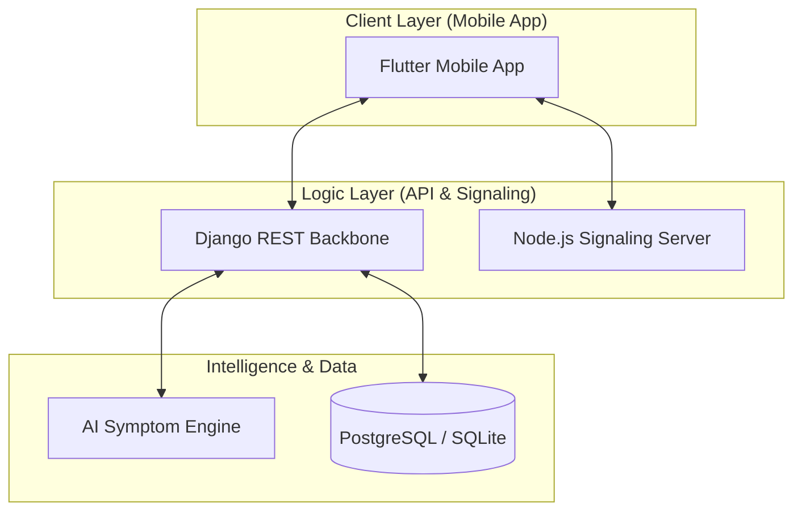

# Rural Healthcare Connectivity Platform 🏥

An integrated healthcare ecosystem designed to bridge the gap between rural communities and medical professionals using AI-driven diagnostics and real-time telemedicine.

---

## 1. Project Overview
The goal of this project is to improve access to healthcare in rural areas by connecting patients, doctors, and ASHA (Accredited Social Health Activist) workers through a high-performance mobile application. The platform focuses on **reliability**, **offline accessibility**, and **triage-first** medical care.


---

## 2. System Architecture
The system follows a distributed micro-modular architecture for maximum availability.



---

## 3. Tech Stack
| Component | Technology | Purpose |
| :--- | :--- | :--- |
| **Frontend** | **Flutter / Dart** | Cross-platform mobile UX. |
| **Backend** | **Django / DRF** | Scalable API & User management. |
| **Database** | **SQLite / PostgreSQL** | Local & Cloud data persistence. |
| **AI / ML** | **Python (Scikit-learn)** | Predictive health analytics. |
| **RTC** | **WebRTC / Socket.io** | Low-latency video consultations. |
| **Maps** | **OpenStreetMap API** | Geographic clinic discovery. |

---

## 4. Main Features

### 👤 User Module
*   **AI Symptom Checker**: Preliminary triage using machine learning.
*   **Medicine Tracker**: Automated reminders for medicine dosage.
*   **Nearby Healthcare**: Map-based clinic and hospital discovery.
*   **Doctor Consultation**: Real-time video/audio calling.

### 🩺 Doctor Module
*   **Patient Management**: Centralized dashboard for village patients.
*   **Digital Prescriptions**: Rapid creation and delivery of medical advice.
*   **Video Consultation**: Full-featured WebRTC calling (mute, toggle camera, etc.).

### 👩‍⚕️ ASHA Worker Module
*   **Patient Monitoring**: Tracking health metrics of village members.
*   **Village Health Alerts**: Proactive notifications for high-risk patients.
*   **Bridge Communication**: Relaying data between doctors and local patients.

---

## 5. Database Models (Core)

### User Model
```python
class User(AbstractUser):
    ROLE_CHOICES = (('user', 'User'), ('doctor', 'Doctor'), ('asha_worker', 'ASHA'))
    phone_number = models.CharField(max_length=15, unique=True)
    role = models.CharField(max_length=20, choices=ROLE_CHOICES)
    village = models.CharField(max_length=100)
```

### Doctor Model
```python
class Doctor(models.Model):
    user = models.OneToOneField(User, on_delete=models.CASCADE)
    specialization = models.CharField(max_length=100)
    hospital_name = models.CharField(max_length=200)
    experience_years = models.IntegerField()
```

---

## 6. Primary API Endpoints

| Category | Endpoint | Method | Result |
| :--- | :--- | :--- | :--- |
| **Auth** | `/api/auth/login/` | `POST` | Get JWT/Session token |
| **Doctors** | `/api/users/doctors/` | `GET` | List all available doctors |
| **Consult** | `/api/consultations/start/` | `POST` | Initiate a medical session |
| **Prescribe**| `/api/prescriptions/` | `POST` | Save medical advice |

---

## 7. AI Symptom Analysis
The system uses a **Random Forest / SVM** based classifier trained on labeled medical data:
1.  **Input**: User selects symptoms (fever, cough, etc.).
2.  **Processing**: Vectorized symptoms are passed to the `ai_engine`.
3.  **Prediction**: System predicts the target disease with a confidence score.
4.  **Action**: If the severity is **High**, the local ASHA worker is notified via WebSocket alert instantly.

---

## 8. Video Consultation (WebRTC)
Our Peer-to-Peer implementation ensures speed and security:
1.  **Signaling**: Node.js server relays the `Offer`, `Answer`, and `ICE Candidates`.
2.  **Handshake**: Mobile apps exchange network tokens via Socket.io.
3.  **P2P Stream**: Once connected, video/audio data flows directly between devices, encrypted with SRTP.

---

## 9. Offline Support
We handle poor connectivity using an **Offline-Resilient Architecture**:
*   **Local Storage**: Uses **SQFlite** and **Hive** for ultra-fast local caching.
*   **Background Sync**: When internet is restored, the `SyncService` pushes local data to the Django cloud.
*   **Persistence**: Medicine alarms are scheduled at the **OS level (Hardware)**, ensuring they fire even without internet or if the app is closed.

---

## 10. Future Improvements
*   **AI Outbreak Detection**: Predictive mapping of village-level infection spikes.
*   **Health Analytics**: Historical trend visualization for chronic patients.
*   **Govt Integration**: Direct synchronization with National Health ID systems.

---
**Gramin Health Connect** — Healthcare for the last mile.
