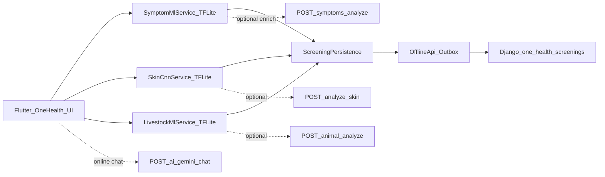

# VitalReach AI/ML Models — National Hackathon Brief

**Product:** VitalReach (One Health offline-first screening)  
**Scope:** Human symptom ML, Skin CNN, Livestock ML (+ related AI)  
**Metrics source:** Measured eval reports under `ai_engine/reports/` (not fabricated)  
**Date baseline:** 2026-08-29 Technical Report  

**Mandatory positioning for every judge answer:**  
These models are **screening / triage / decision-support tools only**. They are **not** a medical or veterinary diagnosis. High/Critical outcomes escalate to ASHA, doctor, or veterinarian.

---

## 1. Executive summary (30-second judge pitch)

VitalReach runs **on-device TensorFlow Lite** models so rural users can screen **without internet**:

| Path | What it does | Offline? |
|------|----------------|----------|
| **Human symptoms** | Maps selected symptoms → disease **risk ranking** (41 classes) | Yes — TFLite MLP |
| **Skin photo** | Classifies lesion image into 22 skin-condition families | Yes — MobileNetV3-Small TFLite |
| **Livestock** | Maps animal signs → **8 condition families** + Critical keyword safety rules | Yes — TFLite MLP |

When online, optional Django APIs can enrich results and raise alerts. All screenings sync later via `OfflineApi` → `ScreeningEvent`.

**We report honest metrics.** Symptom scores look “perfect” on a small synthetic CSV — we **do not** claim clinical accuracy. Skin and livestock scores are moderate; we compensate with **escalation-first UX** and safety rules.

---

## 2. Model inventory

| Domain | Model type | Offline artifact | Size (approx) | Server artifact | Classes | Primary UI |
|--------|------------|------------------|---------------|-----------------|---------|------------|
| Human symptoms | Tabular MLP (+ sklearn RF/LR on server) | `mobile_app/assets/models/symptom_mlp.tflite` + `symptom_labels.json` | ~33 KB | `trained_model.pkl` (~10 MB) | 41 diseases | Symptom Checker / One Health Human |
| Skin | CNN (transfer learning) | `skin_cnn.tflite` + `skin_labels.json` | ~1.1 MB | same TFLite / `.keras` | 22 classes | Symptom Checker → Skin tab |
| Livestock | Tabular MLP (+ RF on server) | `livestock_mlp.tflite` + `livestock_labels.json` | ~8 KB | `livestock_model.pkl` (~7.9 MB) | 8 families | Livestock Screening |
| Language ID | Classifier | `langid.tflite` | small | `POST /api/ai/detect-language/` | EN/HI/MR | Multilingual UX |
| Child development | **Rules only** (not neural net) | In-app heuristics | — | Same screening POST | Risk bands | Child Development |
| Gemini chat | LLM (cloud) | None on device | — | Django `ai_proxy` | Domains: human/skin/livestock/child | Shared AI Health Chat |

**Selection rule (training):** prefer **macro-F1 + high-risk recall**, not training accuracy alone.

---

## 3. End-to-end integration



### Integration stack (what calls what)

| Layer | Component | Role |
|-------|-----------|------|
| UI | `symptom_checker_screen.dart`, One Health livestock/child screens | Collect chips / photo / animal signs |
| On-device ML | `SymptomMlService`, `SkinCnnService`, `LivestockMlService` | Local-first inference |
| Integrity | `model_integrity.json` + `ModelIntegrity` | Hash-check assets before run |
| Provider | `SymptomProvider` (local-first) | Orchestrates TFLite → CSV fallback → optional server |
| Persist | `screening_persistence.dart` | Queue HUMAN/ANIMAL `ScreeningEvent` with `client_id` |
| Sync | `OfflineApi` + `SyncService` + `LocalStore` | Outbox when offline; flush on connectivity |
| Backend analyze | `POST /api/symptoms/analyze/`, `analyze-skin/`, `POST /api/one-health/animal/analyze/` | Optional cloud twin / alerts |
| Backend store | `POST /api/one-health/screenings/` | Canonical synced screening records |
| Safety UI | `ScreeningDisclaimer`, `EscalationSheet`, `ScreeningResultView` | Non-diagnosis wording + escalate |

**Airplane mode:** TFLite still returns a result → saved locally → syncs when network returns.  
**Gemini / live video:** need network by design.

---

## 4. Human symptom model (AI Symptom Checker)

### 4.1 Dataset
| Item | Value |
|------|--------|
| Source | `mobile_app/lib/dataset/disease/dataset.csv` (Kaggle-style symptom–disease table) |
| Raw rows | 4,920 |
| After dedupe | **304 unique** symptom sets |
| Classes | **41** diseases |
| Features | Multi-hot symptom vector (~131 features; see `symptom_labels.json`) |
| Advice join | Disease precaution / description CSVs → labels JSON |
| Split | **70 / 15 / 15** stratified on deduped rows |

### 4.2 Architecture & training
- **Candidates compared:** Logistic Regression, Random Forest, Gradient Boosting, XGBoost  
- **Server best (eval report):** Logistic Regression (Acc/F1 = 1.0 on this split); RF also 1.0  
- **Offline path:** compact **Keras MLP → TFLite** (`symptom_mlp.tflite`) matching same feature/label schema  
- **Inference:** Float32 input vector of selected symptoms → softmax over 41 classes  
- Optional **temperature** scaling from labels JSON (fitted on validation)

### 4.3 Measured test metrics (held-out unique rows)

| Artifact | Accuracy | Macro-F1 | Macro-Recall | Notes |
|----------|----------|----------|--------------|--------|
| Sklearn (best on this split) | **1.0** | **1.0** | **1.0** | Synthetic / tiny unique set |
| Offline MLP TFLite | **1.0** | **1.0** | **1.0** | Same split — see `test_metrics_mlp_tflite` |
| High-risk recall (Malaria, Dengue, TB, Pneumonia, Heart attack, …) | **1.0** | — | — | On **this** synthetic split only |

**Source files:** `ai_engine/reports/human_symptoms_eval.md`, `human_symptoms_eval.json`, `SYMPTOM_ML_FIX_REPORT.md`

### 4.4 How “correctness” is defined
1. Held-out test on **deduplicated** rows (not raw duplicated CSV).  
2. Macro-F1 + high-risk disease recall.  
3. Unit smoke tests: `ai_engine.tests.test_ml_smoke`.  
4. Runtime: UI shows **raw softmax probabilities** + **source badge** (`symptom_mlp_ondevice` vs `dataset_local` vs server).

### 4.5 Honest limitations (say this to judges)
- CSV is **highly duplicated / synthetic**. Near-perfect metrics **do not prove clinical generalization**.  
- Earlier bug: CSV coverage fallback could show **100%** confidence; fixed so TFLite softmax is primary.  
- Never present top disease as “you have X”.

### 4.6 Safety net
- Disclaimer EN/HI/MR; screening wording only.  
- High/Critical → `EscalationSheet` (doctor / ASHA).  
- If TFLite fails → CSV coverage fallback (`dataset_local`) with normalized ranks (not fake 100% for supersets after fix).  
- Optional online enrich: `POST /api/symptoms/analyze/`.

### 4.7 Integration path
```
User selects symptom chips
  → SymptomMlService.tryPredict (TFLite)
  → SymptomProvider builds result + severity
  → ScreeningPersistence queue (HUMAN, symptoms)
  → OfflineApi → /one-health/screenings/
  → Optional: /symptoms/analyze/ when online
```

**Code:**  
`mobile_app/lib/features/ai_symptom_checker/services/symptom_ml_service.dart`  
`mobile_app/lib/providers/symptom_provider.dart`  
`ai_engine/symptoms/`

---

## 5. Skin symptom / lesion model (Skin CNN)

### 5.1 Dataset
| Item | Value |
|------|--------|
| Source | `SkinDisease` **22-class** archive (**not** HAM10000) |
| Samples | **13,898 train + 1,546 test** (report: 15,444 total) |
| Classes | 22 (Acne, Eczema, Psoriasis, SkinCancer, Vitiligo, …) |
| Split | Train 90% + val 10% from train/; held-out **test/** folder |

### 5.2 Architecture & training
- **MobileNetV3-Small** transfer learning (ImageNet backbone)  
- Preprocess (Flutter = Keras): `pixel / 127.5 - 1`  
- Short CPU training (report: ~5+2 epochs; val accuracy ≈ 0.43)  
- Exported **TFLite** into Flutter assets (~1.1 MB)

### 5.3 Measured test metrics

| Metric | Value |
|--------|--------|
| Accuracy | **0.449** |
| Precision (macro) | **0.428** |
| Recall (macro) | **0.421** |
| F1 (macro) | **0.402** |

**High-risk class recalls (test):**

| Class | Recall (approx) |
|-------|-----------------|
| SkinCancer | **0.31** |
| Actinic_Keratosis | **0.33** |
| Vasculitis | **0.46** |
| Bullous | **0.31** |
| Lupus | **0.09** |

**Source:** `ai_engine/reports/skin_eval.md`, `skin_eval.json`

### 5.4 How “correctness” is defined
1. Held-out official **test/** folder (not only validation).  
2. Macro-F1 + per-class and high-risk recalls.  
3. On-device parity with Keras preprocess.  
4. Creates HUMAN `ScreeningEvent` with `input_type=image`.

### 5.5 Honest limitations
- Field lighting, phone cameras, and skin-tone shift will degrade accuracy.  
- High-risk recalls are **moderate → low** → UI must escalate aggressively, not “clear” the patient.  
- Not a dermatology diagnosis.

### 5.6 Safety net
- Screening disclaimer; high-risk labels force clinician path.  
- Persist locally even offline; sync later.  
- Optional: `POST /api/symptoms/analyze-skin/` (+ ScreeningEvent on server).

### 5.7 Integration path
```
Camera / gallery image
  → SkinCnnService (TFLite MobileNetV3)
  → Ranked classes + risk band
  → ScreeningPersistence (HUMAN, image)
  → OfflineApi → /one-health/screenings/
```

**Code:**  
`mobile_app/lib/features/ai_symptom_checker/services/skin_cnn_service.dart`  
`ai_engine/skin/train.py`, `predict.py`

---

## 6. Livestock / animal model (pashu / “vat” screening)

### 6.1 Dataset
| Item | Value |
|------|--------|
| Source | `cleaned_animal_disease_prediction.csv` |
| Raw → deduped | 431 → **421** rows |
| Original labels | 139 fine-grained diseases (**too sparse**) |
| Collapsed targets | **8 condition families** |
| Split | ~**60 / 20 / 20** stratified where possible |

**Families (`livestock_labels.json`):**  
Gastrointestinal, Mastitis_Udder, Neurological, Other, Respiratory, Skin_Parasite, Systemic_Infectious, Zoonotic_HighRisk

### 6.2 Architecture & training
- Candidates: LR / RF / GB / XGB → **Random Forest** selected for server (`livestock_model.pkl`)  
- Offline: compact **MLP TFLite** (`livestock_mlp.tflite` ~8 KB)  
- Features: species one-hots + clinical sign flags + age_norm, etc.  
- **Hybrid inference:** ML first, then **Critical / High keyword rules** override urgency if ML under-calls (Dart + Django `animal_screen.py`)

### 6.3 Measured test metrics

| Metric | Value |
|--------|--------|
| Accuracy | **0.459** |
| Precision (macro) | **0.421** |
| Recall (macro) | **0.324** |
| F1 (macro) | **0.326** |
| High-risk family recall (mean) | **~0.22** |

**Source:** `ai_engine/reports/livestock_eval.md`, `livestock_eval.json`

### 6.4 How “correctness” is defined
1. Family-level classification on held-out split (not 139-way disease ID).  
2. Macro-F1 + high-risk family recall.  
3. Rule override tested in smoke tests (Critical keywords).  
4. Farmer-facing labels: e.g. “Urgent — call vet now” — not Latin disease names as diagnosis.

### 6.5 Honest limitations
- 421 rows / 8 families → **moderate accuracy**; fine-grained disease ML is not viable on this data.  
- Poultry poorly represented (heuristic mapping).  
- Rules are intentional **safety**, not a claim that ML alone is enough.

### 6.6 Safety net
- Critical keyword override in app + server.  
- Escalation to **veterinarians** (`GET /one-health/veterinarians/`, `Doctor.is_veterinarian`).  
- Disclaimer: not a veterinary diagnosis.

### 6.7 Integration path
```
Species + sign chips / text
  → LivestockMlService (TFLite)
  → Keyword Critical/High override if needed
  → ScreeningPersistence (ANIMAL)
  → OfflineApi → /one-health/screenings/
  → Optional: POST /one-health/animal/analyze/
  → Escalate → vet call
```

**Code:**  
`mobile_app/lib/features/ai_symptom_checker/services/livestock_ml_service.dart`  
`backend/django_api/apps/one_health/animal_screen.py`  
`ai_engine/livestock/`

---

## 7. Related AI (supporting, not core classifiers)

| Component | Role | Offline? | Judge note |
|-----------|------|----------|------------|
| **Child development** | Age / weight / milestone **rules** → risk band | Yes | Explicitly **not** a neural net |
| **LangID TFLite** | EN/HI/MR detection | Yes (+ server API) | Multilingual rural UX |
| **Gemini (ai_proxy)** | Education / decision-support chat per domain | Online only | API key **server-only**; never in Flutter |
| **Model integrity** | Asset hash verification | Yes | Fail → Unknown, not Low risk |

---

## 8. Accuracy honesty board (put this on one PPT slide)

| Model | Test Acc | Macro-F1 | What that means for judges |
|-------|----------|----------|----------------------------|
| Human symptoms (sklearn + TFLite) | **1.00** | **1.00** | Perfect on **304 unique synthetic** rows — **not** hospital-grade proof |
| Skin CNN | **0.45** | **0.40** | Useful triage on ~15k images; high-risk recall limited → escalate |
| Livestock (8 families) | **0.46** | **0.33** | Family screening only; Critical **rules** protect under-calls |

### Why this is still a strong hackathon AI story
1. **Measured**, reproducible reports in-repo (`ai_engine/reports/*`).  
2. **Offline-first** on-device inference (rural Super PS requirement).  
3. **Shared One Health** risk + escalation contract for human + animal.  
4. We **do not fake** clinical claims — safety design is part of the product.

---

## 9. How we prove models are “correct enough” (process)

1. **Train / select** with macro-F1 + high-risk recall (`ai_engine/*/train.py`).  
2. **Write metrics** to `*_eval.json` / `*_eval.md` via shared `ai_engine/common/metrics.py`.  
3. **Export TFLite** into `mobile_app/assets/models/` with matching `*_labels.json`.  
4. **Smoke tests:** `python -m unittest ai_engine.tests.test_ml_smoke -v`.  
5. **Runtime correctness UX:** probability display, source badge, integrity check, escalation.  
6. **Manual demo:** airplane mode → symptom / skin / livestock → reconnect → ScreeningEvent sync.

---

## 10. APIs involved

| API | Purpose |
|-----|---------|
| `POST /api/symptoms/analyze/` | Server symptom RF/LR enrich + alerts |
| `POST /api/symptoms/analyze-skin/` | Server/skin path + ScreeningEvent |
| `POST /api/one-health/animal/analyze/` | Livestock ML + Critical rules |
| `POST /api/one-health/screenings/` | Offline sync target (all domains) |
| `GET /api/one-health/veterinarians/` | Vet escalation directory |
| `POST /api/ai/gemini-chat/` | Domain Gemini proxy (key stays on server) |
| `POST /api/ai/detect-language/` | Lang ID server twin |

---

## 11. Key file paths (for viva / code round)

| Area | Path |
|------|------|
| Technical report | `ai_engine/reports/TECHNICAL_REPORT.md` |
| Symptom eval | `ai_engine/reports/human_symptoms_eval.md` |
| Skin eval | `ai_engine/reports/skin_eval.md` |
| Livestock eval | `ai_engine/reports/livestock_eval.md` |
| Symptom TFLite fix | `ai_engine/reports/SYMPTOM_ML_FIX_REPORT.md` |
| Train scripts | `ai_engine/symptoms/`, `ai_engine/skin/`, `ai_engine/livestock/` |
| Flutter ML services | `mobile_app/lib/features/ai_symptom_checker/services/` |
| Assets | `mobile_app/assets/models/*.tflite`, `*_labels.json` |
| Persist / sync | `mobile_app/lib/features/one_health/screening_persistence.dart`, `mobile_app/lib/core/sync/` |
| Backend animal hybrid | `backend/django_api/apps/one_health/animal_screen.py` |
| Gemini proxy | `backend/django_api/apps/ai_proxy/` |

---

## 12. Judge FAQ (English)

**Q: How accurate is your AI?**  
A: We publish held-out metrics: symptoms Acc/F1 = 1.0 on 304 unique synthetic rows (limitation disclosed); skin Acc ≈ 0.45, F1 ≈ 0.40; livestock Acc ≈ 0.46, F1 ≈ 0.33 on 8 families. Models are for **screening**, with escalation — not diagnosis.

**Q: Did you use real hospital EMR data?**  
A: Symptoms use a public-style symptom–disease CSV (synthetic/duplicated). Skin uses a large **clinical photo** 22-class set. Livestock uses a cleaned public animal disease CSV collapsed to families.

**Q: Why TFLite on phone?**  
A: Super PS requires offline-first rural operation. TFLite runs without internet; sync later.

**Q: Are you diagnosing diseases?**  
A: No. UI and API copy say screening / elevated risk / decision-support only, with doctor/ASHA/vet escalation.

**Q: Child screening — which model?**  
A: Rules-based milestone/growth heuristics, not a deep model — still offline and escalates.

**Q: Where is the Gemini API key?**  
A: Only in Django `.env` via `ai_proxy` — never in the Flutter app.

**Q: What if the model is wrong on a Critical case?**  
A: Livestock Critical keyword override; human High/Critical forces escalation UI; missing model → Unknown/error, not Low clearance.

---

## 13. Judge FAQ (Hinglish — team ke liye)

**Q: Symptom AI kitna correct hai?**  
A: Test pe Acc/F1 **1.0** dikhta hai, lekin dataset chhota + synthetic hai — clinic proof nahi. Hum judges ko yahi bolte hain. App pe asli softmax % + source badge aata hai.

**Q: Skin wala?**  
A: ~**45% accuracy**, F1 ~**0.40** — triage ke liye; SkinCancer recall ~**31%**, isliye High-risk pe doctor/ASHA escalate.

**Q: Pashu / livestock wala?**  
A: 8 family pe Acc ~**46%**, F1 ~**33%**. Critical keywords se urgency override — sirf ML pe depend nahi.

**Q: Offline kaise?**  
A: Phone pe TFLite chalta hai → LocalStore outbox → net aate hi Django pe sync.

**Q: Diagnosis claim karenge?**  
A: **Kabhi nahi.** Screening + escalation — Super PS safety framing.

---

## 14. Suggested PPT slides (AI/ML section only)

1. AI stack overview (3 models + offline)  
2. Integration diagram (Section 3)  
3. Symptom model — data + metrics + caveat  
4. Skin CNN — data + metrics + high-risk recall  
5. Livestock — families + metrics + keyword safety  
6. Honesty board (Section 8)  
7. Safety & escalation  
8. Demo: airplane mode → three screenings → sync  

---

## 15. Closing line

> VitalReach’s AI is **measured, offline-capable, and escalation-first**: we report real F1 scores — including imperfect skin and livestock results — and design the product so rural users still get **safe triage** and a path to ASHA, doctors, and veterinarians.
