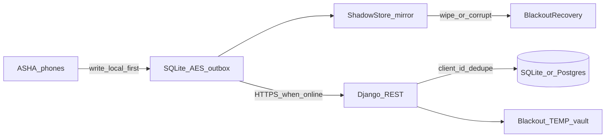

# VitalReach — Judges Sync / Resilience Cheat Sheet

Security deep dive: [`JUDGE_SECURITY_TALKING_POINTS.md`](./JUDGE_SECURITY_TALKING_POINTS.md) · [`SECURITY.md`](../SECURITY.md)  
AI / models: [`AIML_MODELS_HACKATHON.md`](./AIML_MODELS_HACKATHON.md)

Use this page for **viva on crowding, timeouts, corruption, blackout, TrustShield**. Keep claims honest; flash the file paths if judges ask for code.

---

## 30-second opener (English)

> VitalReach is **local-first**: each ASHA phone writes to an **AES-encrypted SQLite outbox**, syncs over **HTTPS** when the network returns, and the server **dedupes with `client_id`** so retries and concurrent workers do not create duplicate health records — plus a **blackout / shadow recover** path and **TrustShield** for misinformation.

## 30-second opener (Hindi / Hinglish)

> Hum pehle **phone pe save** karte hain, baad mein sync — crowd aur timeout dono **outbox + `client_id`** se handle hote hain. Outbox **AES-256-GCM**, network **TLS**, blackout pe **ShadowStore recover** + server **TEMP vault** demo, myths ke liye **TrustShield** (LLM sole truth nahi).

---

## Architecture (one glance)

| Layer | What happens |
|-------|----------------|
| Phone write | `LocalStore.enqueue` → encrypt payload → outbox + shadow dual-write |
| Sync | `SyncService` listens to connectivity → `flush()` drains pending |
| Server | Django REST; screening/stock keyed by `client_id` (idempotent) |
| Failure | `markRetry` keeps item pending; `_alreadyOnServer` avoids double-create |
| Wipe/corrupt primary | `BlackoutRecovery.ensureHealthy()` rebuilds from `ShadowStore` |

---

## Q1 — Data crowd / 4–5 ASHA ek saath push

| Bolna | Dikhana / file |
|-------|----------------|
| “Har ASHA ka phone alag **local outbox** — pehle device pe write, UI success turant.” | `mobile_app/lib/core/sync/local_store.dart` → `enqueue` |
| “Net aate hi har device independently `SyncService.flush()` → Django — shared phone queue nahi.” | `mobile_app/lib/core/sync/sync_service.dart` |
| “Server pe identity **auth token + role** se; client `user_id` trust nahi.” | `apps/common/permissions.py`, `strip_client_identity_fields` |
| “Same screening dubara aaye to **`client_id` idempotency** — ek hi row.” | `apps/one_health/views.py` create; `security_audit/tests.py` → `test_screening_idempotent_client_id` |
| “Inventory stock mutations bhi `client_id` unique.” | `apps/inventory/services.py` |
| “Crowd = many small HTTPS POSTs; Django request-per-request. Cloud pe Postgres via `DATABASE_URL`.” | `config/settings.py` `DATABASES` |

**One-liner for judges:** *Offline-first + idempotent REST — rural ASHA concurrency ke liye design, not a Kafka claim.*

**Mat bolo:** “Kafka / Redis queue / millions TPS already.”

---

## Q2 — Packet gaya, timeout, server tak nahi pahuncha

| Bolna | Dikhana / file |
|-------|----------------|
| “Write path **local-first**: enqueue pehle → sync baad mein. Timeout = server pe kuch nahi, phone pe **pending**.” | `LocalStore.enqueue` + `encryptJson` |
| “Connectivity wapas → `SyncService` outbox drain karta hai.” | `sync_service.dart` → `start()` / `flush()` |
| “Fail pe `markRetry` — item delete nahi hota.” | `local_store.dart` → `markRetry`; flush `catch` |
| “Pehle attempt save ho gaya, retry pe already-on-server → `_alreadyOnServer` → mark synced.” | `sync_service.dart` → `_alreadyOnServer` |
| “`client_id` = same packet do baar bhejo, DB mein ek hi `ScreeningEvent`.” | `POST /api/one-health/screenings/` |

**Live demo:** Airplane mode → ASHA visit / screening → pending badge → reconnect → sync success.

---

## Q3 — Data transit / store pe corrupt

| Layer | Bolna | File |
|-------|-------|------|
| In transit | “HTTPS/TLS — corrupt/incomplete TCP drop/retry; incomplete write accept nahi.” | Django SSL / HSTS in prod; mobile TLS |
| At rest (phone) | “Outbox payload **AES-256-GCM** — tamper → decrypt fail, silent ‘good’ data nahi.” | `secure_payload_crypto.dart` + `local_store.dart` |
| Primary wipe/corrupt | “**ShadowStore** dual-write + `BlackoutRecovery.ensureHealthy()` rebuild.” | `shadow_store.dart`, `blackout_recovery.dart` |
| Retry safety | “Idempotent `client_id` so corrupt-retry pe duplicate clinical rows nahi.” | `one_health/views.py` |

**Mat claim:** Application-level CRC on every API body beyond TLS + AES-GCM + idempotent retry.  
**Mat bolo:** “Full SQLCipher DB” — sirf **payload-level** AES-GCM.

---

## Q4 — Blackout challenge

| Bolna | Dikhana / file |
|-------|----------------|
| “No net → screening / visits phir bhi kaam; encrypted outbox + shadow.” | Airplane + One Health / ASHA flows |
| “Server demo board: Snapshot → Simulate → TEMP vault → Recover.” | `/api/blackout/display/` · `snapshot/` · `simulate/` · `wipe/` · `recover/` |
| “Mobile `SimulateBlackoutButton` demo trigger.” | ASHA dashboard / livestock → `simulate_blackout_button.dart` |
| “Recover screening restore pe bhi `client_id` check (duplicate avoid).” | `apps/blackout/service.py` |

**Honest limits**

| Topic | Bolna |
|-------|--------|
| Blackout control APIs | “Demo control plane (`AllowAny`) for the live board — production would lock it down.” |
| TEMP vault | “Board vault is plaintext JSON for projector demo — phone outbox is AES-GCM.” |
| Live video in blackout | “Screening + records offline-first; live WebRTC needs network by design.” |

**Files:** `backend/django_api/apps/blackout/`, `mobile_app/lib/core/sync/blackout_recovery.dart`, `mobile_app/lib/core/sync/shadow_store.dart`.

---

## Q5 — Trust late / TrustShield (challenge 2)

| Bolna | Dikhana / file |
|-------|----------------|
| “Forwarded health myths → TrustShield; **curated KB is source of truth**; API optional.” | `trustshield_service.dart` → `HealthClaimVerifier` |
| “Offline: local KB verify + last result cache; report queues via `OfflineApi`.” | `TrustedKnowledgeBase`, `putCache('trustshield_last_result')` |
| “Fail-safe: online fail → local KB; never invent VERIFIED without sources.” | `verify()` catch → `_kb.verifyLocal` |
| “Gemini = education chat only (server proxy + PII sanitize) — **not** TrustShield’s sole truth.” | `apps/ai_proxy/`; see security cheat sheet |

**Backend:** `backend/django_api/apps/trustshield/`  
**Endpoints:** `POST /api/trustshield/verify/` · `POST /api/trustshield/report/`

---

## Q6 — Data secure kaise (short — full pillars elsewhere)

Do not re-pitch the whole security deck here. Say four lines, then point to the security sheet:

1. **AuthN** — expiring DRF token (TTL), Keystore/Keychain — not SharedPreferences.  
2. **AuthZ** — RBAC + object scope **server-side**; client `role` / `user_id` not trusted on writes.  
3. **Encrypt** — AES-256-GCM offline outbox + HTTPS/TLS in transit.  
4. **Privacy** — Gemini / Places keys **server-only**; PII sanitized before Gemini; audit trail.

→ Full demo script + code walk: [`JUDGE_SECURITY_TALKING_POINTS.md`](./JUDGE_SECURITY_TALKING_POINTS.md) · [`SECURITY.md`](../SECURITY.md)

---

## Live demo script (~90 seconds)

| # | Time | Action | What to say |
|---|------|--------|-------------|
| 1 | 15s | Airplane ON → ASHA/patient screening or visit | “Local-first — outbox encrypted, UI success without net.” |
| 2 | 15s | Explain 4–5 ASHA mental model | “Each phone own queue; server dedupes with `client_id`.” |
| 3 | 20s | Airplane OFF → sync / pending clears | “Timeouts stay pending → flush on reconnect; no silent loss.” |
| 4 | 25s | Blackout board: Snapshot / Simulate / Recover | “Critical records resilience demo + shadow recover on device.” |
| 5 | 15s | TrustShield: paste a WhatsApp-style claim | “KB + verify path — LLM not sole truth; offline-capable.” |

### Demo URLs (verified in codebase)

| Surface | URL / path |
|---------|------------|
| Blackout projector board | `http://<host>/api/blackout/display/` **or** `http://<host>/blackout/display/` |
| Blackout APIs | `/api/blackout/status/`, `snapshot/`, `simulate/`, `wipe/`, `recover/` |
| Screening sync | `POST /api/one-health/screenings/` (`client_id`) |
| TrustShield | `POST /api/trustshield/verify/`, `POST /api/trustshield/report/` |

---

## Honest Q&A — mat claim karo

| Agar bolein… | Tum bolo |
|--------------|----------|
| Message queue / Kafka? | “Per-device SQLite outbox + idempotent REST — designed for village concurrency, not enterprise bus.” |
| Exactly-once delivery? | “At-least-once sync + `client_id` dedupe → effectively one clinical row.” |
| Packet CRC app-layer? | “TLS in transit + AES-GCM at rest + retry/idempotency — not a custom CRC frame protocol.” |
| SQLCipher? | “Payload AES-GCM on outbox/cache, not full-DB SQLCipher.” |
| Blackout open APIs? | “Demo `AllowAny` board — production would authenticate/authorize.” |
| Encrypted TEMP vault? | “Demo vault plaintext JSON; phone outbox is AES-GCM.” |
| TrustShield = Gemini? | “Separate path: curated KB (+ optional API). Gemini is proxied chat, not the verifier of record.” |
| Millions of ASHA? | “Hackathon-hardened offline-first pattern; horizontal scale = normal Django/Postgres ops next.” |

---

## Code walk order (viva)

1. `mobile_app/lib/core/sync/local_store.dart` — enqueue + encrypt + shadow  
2. `mobile_app/lib/core/sync/sync_service.dart` — flush / retry / `_alreadyOnServer`  
3. `backend/django_api/apps/one_health/views.py` — `client_id` idempotent create  
4. `backend/django_api/apps/security_audit/tests.py` — idempotency test  
5. `mobile_app/lib/core/sync/shadow_store.dart` + `blackout_recovery.dart`  
6. `backend/django_api/apps/blackout/` — TEMP vault board  
7. `mobile_app/lib/core/trustshield/trustshield_service.dart`  
8. [`JUDGE_SECURITY_TALKING_POINTS.md`](./JUDGE_SECURITY_TALKING_POINTS.md) — AuthN/AuthZ/Encrypt/Privacy  

---

## Closing line

> We do not assume perfect networks: **write local, encrypt, retry, dedupe** — so concurrent ASHA workers and blackouts still leave rural health data recoverable and non-duplicated, with TrustShield keeping misinformation out of the care path.
