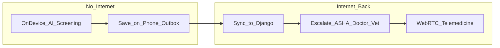

# VitalReach — Project Overview

**Product name:** VitalReach (Gramin Health Connect / One Health)  
**Track:** Track 8 — Health (Super Problem Statement)  
**Constituent PS:** skh038 (Offline-First Telemedicine) · skh039 (AI Childhood Development Screening) · skh040 (AI Livestock Disease Detection)  
**Related SIH context:** Problem Statement 26133 — rural public healthcare access & quality (Maharashtra)

---

## 1. What is this?

**One-liner**

> VitalReach is an **offline-first One Health platform** that screens humans, children, and livestock with on-device AI, syncs records when the network returns, and escalates High/Critical cases to ASHA, doctors, or veterinarians through telemedicine.

**In one paragraph**

VitalReach is a Flutter + Django healthcare system built for villages where internet is weak and specialists are scarce. Patients and ASHA workers can run **symptom**, **skin-photo**, **child-development**, and **livestock** screening **without internet**. Results are saved on the phone and uploaded later. When needed, the app connects the village to a **doctor or vet** via audio/video call, digital prescriptions, and shared escalation — **screening and decision-support only**, never a final diagnosis.

---

## 2. Why we chose this

### The real problem
| Pain | Impact in rural India |
|------|------------------------|
| Few doctors / specialists on site | Delayed care; long travel to PHC / district hospital |
| Few veterinarians | Livestock disease spreads; farmer livelihood at risk |
| Unreliable or no internet | Cloud-only apps fail exactly when people need them |
| Fragmented care | Patient, ASHA, and doctor do not share the same triage picture |
| Literacy / language barriers | Text-only English apps exclude many users |

### Why this Super PS (not only one PS)
Track 8 rewards a **shared One Health architecture**: one offline-sync engine, one risk/escalation model, and coverage of **human + child + animal** care. Solving only telemedicine *or* only livestock is weaker than a platform that:

1. Triages **offline** (skh038 + skh039 + skh040 inputs)  
2. Syncs later  
3. Escalates to the right human (ASHA / doctor / vet)

### Why VitalReach fits
We already strengthen the public continuum **ASHA → Sub-centre → PHC → doctor**, and extend it to **livestock + child screening** under one app — matching Kopargaon-style rural constraints called out in the Super PS.

---

## 3. What solution we provide

| Need | Our solution |
|------|----------------|
| Offline human triage | On-device **symptom MLP (TFLite)** + **skin CNN (TFLite)** |
| Child screening | Age / weight / milestone **rules** → risk band + escalate |
| Livestock screening | On-device **livestock TFLite** + Critical keyword safety rules → **vet** |
| Telemedicine | WebRTC **audio/video** consult; ASHA can start call for a village patient |
| Continuity | Digital **prescriptions**, medicine reminders, health records / visits |
| Sync later | SQLite **outbox** + `OfflineApi` → Django when online |
| Find care nearby | GPS + map/list for hospitals, clinics, labs, pharmacies |
| Frontline ops | Full **ASHA** module (register, visits, alerts, referral) |
| Oversight | React **admin** + **pharmacy** dashboards (pharmacy has offline stock outbox) |
| Safety | Disclaimers EN/HI/MR; High/Critical → **EscalationSheet** (never “you have disease X”) |

---

## 4. Who uses it

| Role | What they do in VitalReach |
|------|----------------------------|
| **Patient** | Symptom/skin check, child screening, call doctor, Rx, medicines, nearby care |
| **ASHA** | Village patients, visits, vitals, alerts, emergency referral, call doctor for patient |
| **Doctor** | Accept consults, video/audio, write Rx, patient history |
| **Veterinarian** | Receive livestock escalations / consults (`is_veterinarian`) |
| **Admin** | Users, screenings stats, blackout, TrustShield, inventory, map markers |
| **Pharmacy** | Stock, expiry, low-stock, offline adjustments |

---

## 5. How it works

1. User opens **One Health** (or Symptom Checker) — works in airplane mode.  
2. AI / rules return a **risk band** + guidance (not a diagnosis).  
3. Result is **queued locally**.  
4. Network returns → sync to backend.  
5. High/Critical → escalate → optional **live consult**.

---

## 6. Tech snapshot

| Layer | Technology |
|-------|------------|
| Mobile | Flutter / Dart (EN–HI–MR) |
| On-device AI | TensorFlow Lite (symptoms, skin, livestock) |
| Backend | Django REST Framework |
| Realtime calls | WebRTC + Node.js Socket.io signaling |
| Offline | sqflite LocalStore, outbox, connectivity sync |
| Cloud AI chat | Gemini via **server proxy only** (key not in app) |
| Web | React admin + pharmacy |

---

## 7. Safety (say on every pitch)

- **Screening / triage / decision-support only** — not medical or veterinary diagnosis.  
- Every High/Critical path has escalation to **ASHA, doctor, or veterinarian**.  
- Automated output must not be presented as a definitive diagnosis.  
- Missing model → Unknown/error — **not** treated as “Low risk / all clear”.

---

## 8. Hinglish summary (team ke liye)

1. **Kya hai:** VitalReach = gaon ke liye offline AI screening + doctor/ASHA/vet telemedicine.  
2. **Kyun choose kiya:** Specialist kam, net kam, insan + baccha + pashu — ek Super PS / One Health.  
3. **Solution:** Phone pe TFLite triage → baad mein sync → zarurat pe call + Rx.  
4. **Roles:** Patient, ASHA, Doctor, Vet, Admin, Pharmacy.  
5. **Rule:** Diagnosis claim mat karna — screening + escalation.

---

## 9. Opening PPT slide tips

| Slide | Use from this doc |
|-------|-------------------|
| Title | Section title block |
| Problem | Section 2 table |
| Solution | Section 3 table |
| Users | Section 4 |
| Flow | Section 5 diagram |
| Safety | Section 7 |

---

## 10. Read next (depth)

| Doc | Use when |
|-----|----------|
| [SUPER_PS_TRACK8_WHAT_WE_BUILT.md](./SUPER_PS_TRACK8_WHAT_WE_BUILT.md) | Full feature map, demo script, slide outline |
| [AIML_MODELS_HACKATHON.md](./AIML_MODELS_HACKATHON.md) | Model accuracy, datasets, judge FAQ on AI |
| [PS26133_TEAM_BRIEFING.md](./PS26133_TEAM_BRIEFING.md) | SIH 26133 mapping and honest status |
| [SOLUTION_SIMPLE_EXPLAIN.md](./SOLUTION_SIMPLE_EXPLAIN.md) | Friend-level Hinglish feature examples |

---

## 11. Closing line

> We did not build “another video-call app.” We built an **offline-first One Health triage + care bridge** so rural families get earlier screening and a clear path to ASHA, doctors, and veterinarians — with or without internet.
