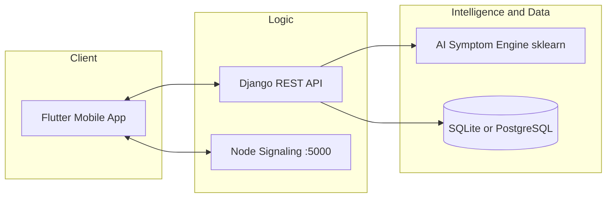
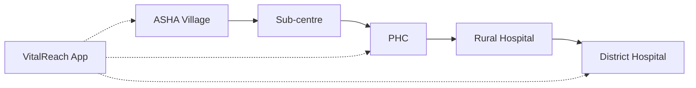
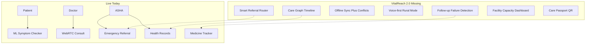
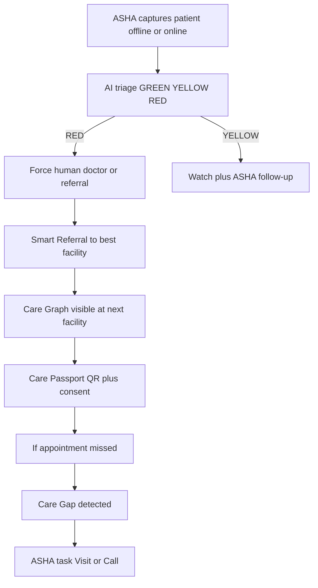
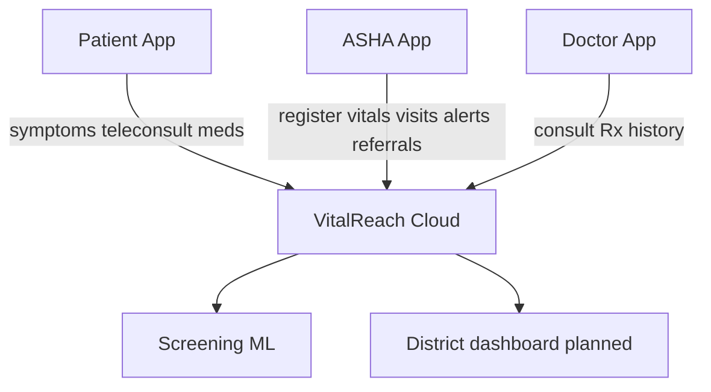

# VitalReach — SIH Problem Statement 26133  
## Team Briefing Document (Explain & Present)

**Use this file** when explaining the project to teammates, mentors, or for PPT outline.  
**Related deep dive:** [VITALREACH_2.0_SIH_2026_REPORT.md](./VITALREACH_2.0_SIH_2026_REPORT.md)

| Field | Value |
|-------|--------|
| **Problem Statement ID** | **26133** |
| **Title** | Accessibility and quality of public healthcare services, particularly in rural and underserved areas |
| **Organization** | Government of Maharashtra |
| **Department** | Maharashtra State Innovation Society (Skills, Employment, Entrepreneurship and Innovation) |
| **Category** | Software |
| **Theme** | MedTech / BioTech / HealthTech |
| **Our product** | VitalReach (Gramin Health Connect) |

---

## 1. One-liner for the team

> **We strengthen — not replace — the public health continuum:** ASHA → Sub-centre → PHC → Rural Hospital → District Hospital, with assisted teleconsultation, digital triage, longitudinal records, referral tracking, and high-risk follow-up.

**Are we solving 26133?**  
**Yes.** The problem describes travel barriers, specialist shortage, fragmented records, delayed referrals, low connectivity/language/literacy. VitalReach already covers teleconsult + ML triage + ASHA village ops + referrals; VitalReach 2.0 adds continuity graph, smart referral, care gaps, and Care Passport so judges see a full public-system story — not “another video-call app.”

**Honesty rule for the team:** Do **not** claim Continuity Graph / Smart Referral / full offline sync / Care Passport / district capacity as **done** until they are shipped. Foundations are live; differentiators are the build plan.

---

## 2. Problem → Expected solution → Our coverage

### 2.1 Pain points (from PS description)

| PS pain | How VitalReach addresses it | Status |
|---------|----------------------------|--------|
| Long travel distances | WebRTC teleconsult; nearby facilities map (OSM) | **LIVE** |
| Shortage of specialists | Remote doctor consult; ASHA can initiate for patient | **LIVE** |
| Irregular / uncoordinated diagnostics | Diagnostic order tracking | **NOT YET** (extra idea) |
| Fragmented medical records across levels | Care Graph + Care Passport | **PLANNED (Must)** |
| Delayed / incomplete referrals | Manual emergency referral today; Smart Referral + Care Gaps | **PARTIAL → PLANNED** |
| Limited awareness of services | Nearby healthcare + ASHA bridge | **LIVE / PARTIAL** |
| Constrained PHC staff / equipment | Facility capacity dashboard | **PLANNED (thin)** |
| Connectivity / language / literacy | Offline meds + login; voice (patient); ASHA voice + outbox | **PARTIAL → PLANNED** |
| Affordability | Prefer public facilities + reduce travel | **Narrative** (product design) |
| Strengthen public system (not replace) | Roles: Patient, ASHA, Doctor; AI = screening + human escalation | **LIVE design** |

### 2.2 Expected solution / outcome checklist

| Expected by PS 26133 | VitalReach status | Notes |
|----------------------|-------------------|--------|
| Assisted teleconsultation | **LIVE** | WebRTC + Node signaling `:5000` |
| Appointment & queue management | **NOT YET** | Doctor schedule is placeholder; queue tokens = extra |
| Digital triage | **LIVE / PARTIAL** | Real RandomForest ML; need RYG + forced escalation UI |
| Longitudinal patient records | **PARTIAL** | Records/visits/Rx exist as silos; need Care Graph |
| Referral tracking | **LIVE / PARTIAL** | Create + history; need completion + smart routing |
| Diagnostic coordination | **NOT YET** | Extra priority for SIH |
| Medicine availability visibility | **PARTIAL** | Patient medicine tracker; not PHC stock board |
| High-risk patient follow-up | **PARTIAL** | Alerts exist; Care Gap engine planned |
| Facility dashboards | **NOT YET** | React admin hardcoded; district dashboard planned |
| Frontline health worker support | **LIVE** | Full ASHA module (patients, visits, vitals, alerts) |
| Low-connectivity environments | **PARTIAL** | Meds offline + login; full outbox planned |
| Multilingual interaction | **PARTIAL** | EN/HI symptom checker; Marathi ASHA voice planned |
| Emergency escalation | **LIVE / PARTIAL** | Emergency referral + AI High/Critical alerts |
| Interoperable records (standards) | **NOT YET** | ABHA / FHIR thin adapter planned as extra |

### 2.3 Expected outcomes → how we claim them in demo

| Outcome | Demo claim (honest) |
|---------|---------------------|
| Reduced travel / waiting | Teleconsult + (later) OPD queue tokens |
| Earlier consultation | AI triage → escalate to doctor |
| Improved referral completion | Care Gaps “missed referral” → ASHA task |
| Better maternal / child / chronic follow-up | Cohort packs + Care Gaps (after Must list) |
| Medicine / diagnostic visibility | Tracker today; stock + lab tracking next |
| Quality monitoring | Facility / quality scorecard (later) |

---

## 3. Diagrams (for PPT / Notion / GitHub)

> Tip: Mermaid renders in GitHub, VS Code Markdown preview, and many PPT plugins. Export to Word:  
> `pandoc docs/PS26133_TEAM_BRIEFING.md -o docs/PS26133_TEAM_BRIEFING.docx`

### 3.1 System architecture (what we built)



### 3.2 Public care continuum (PS 26133 — do not replace this)



**Talking point:** Patient may move PHC → District Hospital. Without VitalReach, history is oral / paper / lost. With Care Graph + Passport, next doctor gets context.

### 3.3 Live vs missing (2.0 gap)



### 3.4 Ideal SIH demo journey — “Ramesh, Kaman Village”



### 3.5 Roles in one picture



---

## 4. What we HAVE today (show & explain)

### 4.1 By role

| Role | Live capabilities | Proof (APIs / modules) |
|------|-------------------|------------------------|
| **Patient** | Login/OTP, AI symptom checker, medicine tracker + alarms, nearby clinics, video/audio doctor, prescriptions, notify ASHA | `/api/symptoms/analyze/`, `/api/medicines/`, `/api/consultations/`, `/api/prescriptions/` |
| **ASHA** | Village patients, register patient, visits, update health/vitals, risk alerts, village report, emergency referral, call doctor for patient, settings | `/api/patients/`, `/api/asha/visits/`, `/api/records/`, `/api/alerts/`, `/api/asha/dashboard/` |
| **Doctor** | Patients list, WebRTC consult, prescriptions, consultation history | Same consult/Rx APIs; schedule & patient-request UI still placeholder |

### 4.2 Technical strengths (rare for SIH mockups)

1. **Real ML** — RandomForest on disease/symptom dataset (`ai_engine/`), not a fake calculator.  
2. **Real WebRTC** — Node signaling + Flutter call screen.  
3. **ASHA–village link** — `User.village` ↔ `ASHAWorker.assigned_village`.  
4. **Working referral + vitals + visits APIs** — not slides-only.

### 4.3 Known weaknesses (say this inside the team)

- No single **patient journey** screen yet (data is fragmented).  
- Offline is **medicines + login**, not full clinical sync.  
- Doctor **calendar / requests** are dummy.  
- Web admin dashboard is **hardcoded**.  
- Multilingual / voice is **patient checker only**.

---

## 5. What we MUST / SHOULD add (7 differentiators + Care Passport)

### Must (ship for SIH)

| # | Differentiator | One-line for team | Effort |
|---|----------------|-------------------|--------|
| 1 | **Continuity-of-Care Graph** | One timeline: visits, vitals, referrals, consults, Rx across facility levels | Medium |
| 2 | **AI Triage RYG + human escalation** | RED = AI cannot handle → force doctor/referral | Low–Med |
| 3 | **Follow-up Failure Detection** | Missed referral / incomplete meds → ASHA task | Medium |
| 4 | **Care Passport** | Consent QR / printable: allergies, meds, vitals, open referrals | Medium |

### Should (if time)

| # | Differentiator | One-line |
|---|----------------|----------|
| 5 | **Smart Referral Router** | Urgency + specialty + distance + capacity → Top-3 facilities |
| 6 | **Offline store → sync → conflict** | ASHA works offline; encrypted outbox; resolve conflicts |

### Thin / later

| # | Item | Note |
|---|------|------|
| 7 | Facility Capacity Dashboard | Seeded demo district OK for SIH |
| 8 | Full Marathi NLP / IVR | ASHA voice mode first; IVR later |

### Minimal new models (engineering)

```text
Facility, CareEvent, ReferralRecommendation,
SyncOutbox, CareGap, AshaTask, CarePassportGrant
```

Details: [VITALREACH_2.0_SIH_2026_REPORT.md](./VITALREACH_2.0_SIH_2026_REPORT.md) Parts D–E.

---

## 6. Ideas BEYOND the 7 differentiators

Still on-theme for **26133** and Maharashtra public health — use for brainstorm / stretch goals.

| Extra idea | Why it fits PS 26133 | SIH priority if time |
|------------|----------------------|----------------------|
| **Appointment + OPD queue tokens** | Explicit outcome: reduce waiting time | **Top 3** |
| **Diagnostic order tracking** | Irregular diagnostics / diagnostic coordination | **Top 3** |
| **Medicine stock visibility at PHC** | Medicine availability visibility | High |
| **Maternal / child / NCD cohort packs** | High-risk follow-up for priority groups | High |
| **Emergency SOS → nearest facility + ASHA** | Emergency escalation | Medium |
| **Quality / accountability scorecards** | Quality monitoring expected outcome | Medium |
| **ABDM / ABHA / FHIR thin adapter** | Interoperable records / approved standards | **Top 3** |
| **Low-bandwidth “lite mode”** | Connectivity constraint | Medium |
| **ASHA workload + incentive dashboard** | Frontline worker support (MH focus) | Medium |
| **Outbreak / village disease heatmap** | Continuity + public-health accountability | Nice-to-have |

**If only one stretch after Must:** Queue tokens **or** Diagnostic tracking (both named in the PS expected solution).

---

## 7. Five-minute talk script (for explaining to teammates)

Use this order; ~1 minute per block.

1. **Problem (30s)**  
   “26133 — rural patients travel far, records break when they move PHC to district hospital, referrals get lost, ASHA and PHCs are overloaded. Maharashtra wants software that **strengthens** the public chain.”

2. **Our answer (30s)**  
   “VitalReach: Patient + ASHA + Doctor apps. Teleconsult, ML screening, village ASHA ops, referrals, medicines. We don’t replace PHC — we give them continuity.”

3. **What works live now (90s)**  
   “Demo: ASHA registers village patient → vitals → AI triage → emergency referral → doctor video + prescription. Real sklearn model, real WebRTC.”

4. **What we still build — Must list (90s)**  
   “Judges will ask about fragmented records. So we ship Care Graph, RYG escalation, Care Gaps, Care Passport. Smart Referral and offline sync if time.”

5. **Ownership ask (30s)**  
   “Who owns Care Graph API? Who owns Flutter Patient Journey? Who owns Passport QR? Who owns demo script Ramesh?”

6. **Close (20s)**  
   “Win path = one patient story end-to-end, not seven half screens.”

---

## 8. Do / Don’t say (judges & PPT)

### Do say

- Continuity across **ASHA → PHC → District Hospital**, not only video calls  
- AI is **screening** with **mandatory human escalation** on RED  
- Offline for **ASHA last-mile** (only after outbox exists)  
- Care Passport is **consent-based**  
- We **support** the public system  

### Don’t say

- “Fully offline encrypted conflict-free EHR” until true  
- “AI diagnoses disease”  
- “ABHA integrated” unless the adapter is real  
- “All 7 differentiators already live”  

**Brand line:** *VitalReach 2.0 — Continuity of care for the last mile.*

---

## 9. Team ownership board (fill in names)

| Workstream | Owner | Status |
|------------|-------|--------|
| Care Graph (backend + Doctor UI) | | Must |
| RYG triage + escalation UX | | Must |
| Care Gaps + ASHA tasks | | Must |
| Care Passport QR / PDF | | Must |
| Smart Referral + seed facilities | | Should |
| Offline outbox | | Should |
| Queue tokens / diagnostics (extra) | | Stretch |
| Demo script “Ramesh” rehearsal | | All |

---

## 10. Quick SIH scorecard (share with team)

| Criterion | Today | After Must list |
|-----------|-------|-----------------|
| Fit to 26133 | Strong | Stronger |
| Working product | High (ML + WebRTC + ASHA) | High |
| Novelty vs telemed clones | Medium | High (Graph + Gaps + Passport) |
| Demo clarity | Needs one story | High if Ramesh script rehearsed |
| Overclaim risk | High if offline/ABHA claimed early | Controlled if honest |

**Bottom line for the team:** We **are** solving PS **26133**. Foundations are real. Winning depends on shipping the **Must** continuity features and telling **one** public-health story — not listing every screen.

---

## Export to Word / PDF

```bash
# From repo root (if pandoc installed)
pandoc docs/PS26133_TEAM_BRIEFING.md -o docs/PS26133_TEAM_BRIEFING.docx
pandoc docs/PS26133_TEAM_BRIEFING.md -o docs/PS26133_TEAM_BRIEFING.pdf
```

Or open the Markdown in Word / Google Docs and paste Mermaid diagrams as images from a Mermaid live editor.
