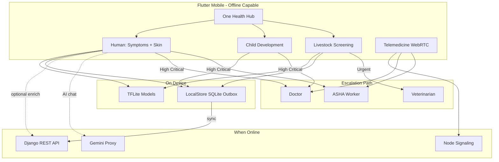

# Track 8 Super PS — What We Built (PPT Notes)

**Product:** VitalReach (Gramin Health Connect / One Health)  
**Track:** Track 8 — Health  
**Super Problem Statement:** Offline-First AI Screening & Care Platform (One Health)  
**Constituent PS covered:**

| ID | Theme | How we cover it |
|----|--------|-----------------|
| **skh038** | Offline-First Telemedicine Platform | Patient ↔ Doctor ↔ ASHA video/audio consult, Rx, offline sync |
| **skh039** | AI Childhood Development Screening | Milestone + growth screening (rules), offline save, escalation |
| **skh040** | AI Livestock Disease Detection | On-device TFLite livestock screening + vet escalation |

**Target context:** Rural / low-connectivity settings (e.g. Kopargaon-style PHC–ASHA continuum)  
**Positioning (mandatory):** Screening / triage / decision-support only — **never** a final medical or veterinary diagnosis. Always escalate to doctor, ASHA, or veterinarian.

**Related AI/ML deep dive:** [AIML_MODELS_HACKATHON.md](./AIML_MODELS_HACKATHON.md)

---

## 1. One-liner (use on opening PPT slide)

> **VitalReach is an offline-first One Health platform:** on-device AI screens humans, children, and livestock without internet; results sync later; High/Critical cases escalate to ASHA, doctors, or vets via telemedicine — strengthening rural care when specialists and connectivity are scarce.

---

## 2. Problem → Our solution (judge narrative)

### Pain (from Super PS)
- Shortage of specialists and veterinarians  
- Unreliable / no internet → delayed diagnosis for humans **and** animals  
- Need triage using images, symptoms, growth/behaviour data  
- Must work **offline-first**, sync when online  
- Prefer shared **One Health** architecture  

### What we deliver
| Need | Our implementation |
|------|-------------------|
| Offline AI triage | On-device TFLite (symptoms, skin, livestock) + child rules |
| Human telemedicine | WebRTC audio/video + ASHA bridge + digital Rx |
| Child screening | Age / weight / milestone concerns → risk band + escalate |
| Livestock screening | Species + signs → TFLite + Critical keyword rules → vet |
| Sync later | SQLite outbox + OfflineApi + SyncService |
| Shared One Health | Same risk bands, disclaimer, ScreeningEvent, escalation UI |
| Safety | Disclaimers EN/HI/MR + EscalationSheet (never “you have disease X”) |

---

## 3. Architecture (one PPT diagram slide)



### Tech stack (short table for PPT)

| Layer | Technology |
|-------|------------|
| Mobile | Flutter / Dart, EN–HI–MR localization |
| On-device AI | TensorFlow Lite (symptom MLP, skin CNN, livestock MLP) |
| Backend | Django REST Framework |
| Calls | WebRTC + Socket.io signaling |
| Offline | sqflite LocalStore, outbox, connectivity-triggered sync |
| Optional cloud AI | Gemini via **server proxy only** (key never in app) |
| Admin / Pharmacy | React dashboards |
| Nearby care | GPS + Google Places (Django proxy) + Maps SDK |

---

## 4. Mapping Super PS → features we actually built

### 4.1 skh038 — Offline-First Telemedicine Platform

**What we built**

| Area | Details |
|------|---------|
| **Roles** | Patient, Doctor, ASHA (OTP login) |
| **Consult** | Audio / video WebRTC; emergency flag; ASHA can start call for village patient |
| **Doctor** | Dashboard, patients, create digital prescription, consultation history |
| **ASHA** | Village patients, register, visits, vitals, risk alerts, emergency referral, call doctor |
| **Patient** | Book / join consult, prescriptions viewer, medicine tracker + reminders, alerts |
| **Offline** | Clinical writes (visits, records, meds, screenings) → phone outbox → sync when network returns |
| **Online-only by design** | Live video/audio needs network (signaling + WebRTC) |

**Demo talking points**
1. Patient or ASHA starts consult → doctor joins on device.  
2. Doctor writes Rx → patient sees it in app.  
3. Turn airplane mode → ASHA still registers visit / screening → reconnect → sync banner uploads.

**Key modules**
- Flutter: `CallScreen`, doctor video/audio screens, ASHA call, appointments  
- Backend: `consultations`, `prescriptions`, `asha_workers`, `patients`  
- Signaling: `realtime_server/node_signaling_server/`

---

### 4.2 skh039 — AI Childhood Development Screening

**What we built**

| Area | Details |
|------|---------|
| **Entry** | One Health Hub → Child Development |
| **Inputs** | Child age (months), weight, milestone / concern chips |
| **Engine** | **Rule-based** screening (`source: child_rules`) — age-appropriate milestones + growth heuristics |
| **Output** | Risk: Low / Moderate / High / Critical + plain-language guidance |
| **Offline** | Result saved locally; queued to `/api/one-health/screenings/` when online |
| **Safety** | “Screening only — not a paediatric diagnosis”; escalate to ASHA / doctor |
| **Optional** | Domain Gemini education chat (online, decision-support only) |

**Demo talking points**
1. Airplane mode → enter age + concerns → get risk band offline.  
2. High/Critical → Escalation sheet → call / notify ASHA or doctor.  
3. Reconnect → screening appears in backend / admin stats.

**Honest claim for judges:** Child path is **rules-based clinical heuristics**, not a neural net — still valid offline screening + escalation for rural use. Human symptom/skin paths use real ML.

---

### 4.3 skh040 — AI Livestock Disease Detection

**What we built**

| Area | Details |
|------|---------|
| **Entry** | One Health Hub → Livestock Screening |
| **Inputs** | Species, sign chips / free text, case history |
| **On-device AI** | `livestock_mlp.tflite` (~8 KB) — condition **family** classifier |
| **Safety net** | Keyword Critical/High override if ML under-calls urgent signs |
| **Cloud twin** | `POST /api/one-health/animal/analyze/` + `livestock_model.pkl` |
| **Cases** | Livestock case CRUD; history on device |
| **Escalation** | Vet directory `GET /one-health/veterinarians/` → call vet (`Doctor.is_veterinarian`) |
| **Offline** | Infer offline → queue ScreeningEvent (ANIMAL domain) |

**Demo talking points**
1. Farmer / ASHA selects cattle + critical signs offline → “Urgent — call vet”.  
2. Tap escalate → veterinarian list → start call.  
3. Sync later; admin can see animal screening stats.

---

## 5. Shared One Health layer (scoring advantage)

Judges prefer **one architecture** for human + animal. We use:

| Shared piece | Implementation |
|--------------|----------------|
| **One Health Hub** | Single entry: Human / Livestock / Child / TrustShield |
| **Risk bands** | Low → Moderate → High → Critical (same policy) |
| **UI kit** | `ScreeningResultView`, `ScreeningDisclaimer`, `EscalationSheet`, `SharedAIHealthChat` |
| **Data model** | `ScreeningEvent` with `domain` HUMAN \| ANIMAL, `input_type`, `client_id` idempotency |
| **Persistence** | `ScreeningPersistence` → OfflineApi → Django `one_health` |
| **Disclaimer languages** | English, Hindi, Marathi |
| **Escalation routing** | Human → Doctor / ASHA; Animal → Veterinarian |

```
HUMAN: Symptom TFLite + Skin CNN + Child rules
ANIMAL: Livestock TFLite + Critical keyword rules
        → Risk band → Offline queue → Sync
        → Escalate: Doctor / ASHA / Vet
```

---

## 6. On-device AI inventory (PPT “Models” slide)

| Domain | Model / method | Where | Notes |
|--------|----------------|-------|-------|
| Human symptoms | `symptom_mlp.tflite` + labels | Phone (local-first) | Optional cloud RF enrich |
| Skin photo | `skin_cnn.tflite` (MobileNetV3-Small, ~22 classes) | Phone | Image triage |
| Livestock | `livestock_mlp.tflite` | Phone | + Critical keyword override |
| Child | Rules engine | Phone | Milestone / growth |
| Language | `langid.tflite` | Phone + API | Multilingual support |
| Integrity | `model_integrity.json` | Phone | Hash check before run |
| Gemini chat | Server proxy only | Django `ai_proxy` | Domains: human / skin / livestock / child |

**Training / reports:** `ai_engine/` (symptoms, skin, livestock, langid) + `ai_engine/reports/`  
**Full metrics & judge FAQ:** [AIML_MODELS_HACKATHON.md](./AIML_MODELS_HACKATHON.md)

| Model | Test Acc | Macro-F1 | Honest caveat |
|-------|----------|----------|---------------|
| Symptoms | ~1.0 | ~1.0 | Synthetic 304 unique rows — not clinical proof |
| Skin | ~0.45 | ~0.40 | Escalate high-risk; field photos harder |
| Livestock | ~0.46 | ~0.33 | 8 families + Critical rules |

---

## 7. Offline-first sync (must-show demo)

### How it works
1. **Write path:** App saves to encrypted SQLite **outbox** first → shows success on phone.  
2. **Read path:** Prefer network; if fail → last **cache**.  
3. **Sync:** Connectivity returns → `SyncService` drains outbox → Django.  
4. **Idempotency:** `client_id` so retries don’t duplicate screenings.

### Works offline
- Symptom / skin / livestock / child screening  
- ASHA register / visits / health updates  
- Medicine tracker writes  
- Chat drafts  
- Nearby healthcare **cached list**  

### Needs internet
- Live video / audio consult  
- Gemini AI chat  
- Fresh Google Places nearby search (cache still shows last results)

### Blackout / resilience (extra demo)
- Admin **Blackout** + TEMP vault for sensitive animal / Rx data  
- Shadow store / recovery if local DB corrupt  

---

## 8. Full product surface (extra PPT slides if time)

### Patient
- AI Symptom Checker (symptoms + skin)  
- One Health Hub (human / child / livestock)  
- Doctor consult (audio/video)  
- Medicine reminders  
- Nearby Healthcare (GPS + map + list: hospitals, clinics, labs, pharmacies)  
- Emergency help / notify ASHA  
- Prescriptions viewer  
- TrustShield (claim verification)  

### Doctor
- Dashboard, patients, WebRTC consult, digital Rx, history  
- Vet flag for livestock escalation  

### ASHA
- Village caseload, register patient, visits, vitals, alerts  
- Emergency referral  
- Call doctor on behalf of patient  

### Web Admin (React)
- Live stats (including human/livestock screenings)  
- Users, doctors (verification), ASHA, consultations, Rx, alerts, inventory, blackout, TrustShield, map markers  

### Web Pharmacy (React)
- Stock, expiry, low stock, suppliers, map  
- **IndexedDB offline outbox** for stock adjustments  

---

## 9. Safety framing (mandatory — put on every AI slide)

Copy these bullets for judges:

1. **Screening / triage / decision-support only** — not a medical or veterinary diagnosis.  
2. **Every High/Critical path** has escalation to qualified doctor, ASHA, or veterinarian.  
3. Automated output **never** says “you have [disease]” as a definitive diagnosis.  
4. Gemini responses include domain disclaimers + Evidence-style decision support.  
5. Missing model → **Unknown / error**, not falsely marked Low risk.  

UI components: `ScreeningDisclaimer`, `EscalationSheet`, severity chips, farmer-facing livestock urgency labels.

---

## 10. Suggested PPT slide outline (ready to copy)

| # | Slide title | Content to put |
|---|-------------|----------------|
| 1 | Title | VitalReach — Offline-First AI Screening & Care (One Health) · Track 8 |
| 2 | Super PS | skh038 + skh039 + skh040 in one platform |
| 3 | Problem | Specialist shortage + no internet → delayed human & animal care |
| 4 | Solution one-liner | Section 1 above |
| 5 | Architecture | Mermaid / simple 3-layer: Mobile AI → Offline Sync → Telemedicine |
| 6 | One Health Hub | Human / Child / Livestock / shared risk + escalation |
| 7 | skh038 Telemedicine | Roles, WebRTC, ASHA bridge, Rx, offline outbox |
| 8 | skh039 Child | Inputs, rules screening, offline, escalate |
| 9 | skh040 Livestock | TFLite + rules, vet escalate, offline |
| 10 | On-device AI | Table of models + honesty metrics |
| 11 | Offline sync demo | Airplane → screen → reconnect → sync |
| 12 | Safety | Decision-support + escalation (mandatory box) |
| 13 | Extra value | Nearby healthcare, pharmacy offline, admin dashboard, TrustShield |
| 14 | Tech stack | Flutter, Django, TFLite, WebRTC, React |
| 15 | Demo flow | 60–90 sec script below |
| 16 | Impact | Earlier triage, less travel, One Health continuity |

---

## 11. Live demo script (~90 seconds)

1. **Airplane mode ON**  
2. Open **One Health** → **Human symptoms** → select chips → show local risk + disclaimer.  
3. Open **Livestock** → critical signs → “Urgent — call vet”.  
4. Open **Child Development** → age + concerns → risk band.  
5. Airplane mode **OFF** → show sync / uploaded screenings.  
6. **Telemedicine:** ASHA or patient calls doctor → short WebRTC join.  
7. Optional: **Nearby Healthcare** recenter → real hospitals/clinics list + map.  
8. Close with: *“Screening only — escalation to ASHA / doctor / vet is built in.”*

---

## 12. Honest limits (say this if judges ask)

| Topic | Honest status |
|-------|----------------|
| Child AI | Rules-based heuristics (not deep learning) |
| Live video offline | Not possible — needs network; screening + records are offline-first |
| Symptom Acc 1.0 | Synthetic CSV — not clinical proof (see AIML doc) |
| Continuity Graph / Care Passport / full FHIR | Roadmap / partial — don’t claim as finished unless shipped |
| Doctor calendar / OPD queue | Limited / placeholder areas |

---

## 13. Key repo paths (backup if mentor asks “where is the code?”)

| Area | Path |
|------|------|
| One Health UI | `mobile_app/lib/features/one_health/` |
| Symptom / skin | `mobile_app/lib/features/user/screens/symptom_checker_screen.dart` |
| On-device ML | `mobile_app/lib/features/ai_symptom_checker/services/` |
| Models | `mobile_app/assets/models/*.tflite` |
| Offline sync | `mobile_app/lib/core/sync/` |
| Backend One Health | `backend/django_api/apps/one_health/` |
| Gemini proxy | `backend/django_api/apps/ai_proxy/` |
| Consultations | `backend/django_api/apps/consultations/` |
| AI training | `ai_engine/` |
| Team briefing | `docs/PS26133_TEAM_BRIEFING.md` |
| AI/ML metrics | `docs/AIML_MODELS_HACKATHON.md` |

---

## 14. Closing impact statement (last PPT slide)

> For Kopargaon-style rural settings with **no reliable internet and no on-site specialists**, VitalReach provides **meaningful offline triage** for humans, children, and livestock, then **syncs** and **escalates** to ASHA, doctors, and veterinarians — a single **One Health** care platform that assists, never replaces, clinical judgement.
