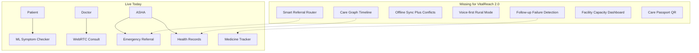

# VitalReach 2.0 — SIH 2026 Differentiator Report

**Project:** VitalReach / Gramin Health Connect (SKH2026)  
**Audience:** Team + SIH judges preparation  
**Problem statement:** **26133** — Accessibility and quality of public healthcare (rural / underserved), Government of Maharashtra  
**Team briefing (explain to teammates):** [PS26133_TEAM_BRIEFING.md](./PS26133_TEAM_BRIEFING.md)  
**Date:** August 2026  

---

## Executive verdict

**Yes — you can compete seriously for SIH 2026**, but **not by claiming all 7 differentiators as already built**. Judges punish vaporware. Your win path is:

1. **Prove** what is already live (telemedicine + ML triage + ASHA–village link + referrals).
2. **Ship 3–4 differentiators deeply** with a live demo story (not 7 half-finished screens).
3. **Map every feature to the problem** (fragmented records, weak referral continuity, rural access).

**Recommended demo thesis (one sentence):**  
*VitalReach turns fragmented rural encounters into a continuity-of-care graph — ASHA captures offline, AI triages safely, Smart Referral routes to the right facility, and Care Passport carries context to the next doctor.*

| Question | Answer |
|----------|--------|
| Are the 7 differentiators right? | **Yes** — especially Care Graph, Care Gaps, Smart Referral, Passport |
| Do you have them today? | **Mostly no** — foundations yes, differentiators no |
| Can you win SIH 2026? | **Contender yes**, if you ship the Must list + one killer demo story |
| Biggest advantage | Real ML + WebRTC + ASHA ops already live |
| Biggest risk | Overclaiming offline / admin / IVR |

---

## Part A — What VitalReach is today (code reality)

### Live (demo-ready)

| Area | What works | Evidence |
|------|------------|----------|
| Roles | Patient, Doctor, ASHA | Auth + role routing |
| Village link | ASHA sees village patients | `User.village` ↔ `ASHAWorker.assigned_village` |
| Patient CRUD (ASHA) | Register / list / edit | `POST /api/users/register/`, `/api/patients/` |
| Health vitals | Create / list records | `/api/records/` |
| Village visits | Schedule / complete | `/api/asha/visits/` |
| Risk alerts | Manual + AI High/Critical | `/api/alerts/notifications/` |
| Emergency referral | Create + history | `/api/alerts/referrals/` |
| Telemedicine | WebRTC video/audio | `/api/consultations/start/` + Node `:5000` |
| Prescriptions | Create + patient view + PDF | `/api/prescriptions/` |
| Medicine tracker | Schedules + OS alarms | `/api/medicines/` + local SQLite |
| AI triage | Real RandomForest ML | `ai_engine/predict.py` + `/api/symptoms/analyze/` |
| Voice (patient) | STT + Hindi word map | Symptom checker only |
| Nearby care | OSM Overpass map | Patient nearby screen |

### Partial / historically overclaimed

| Claim | Reality |
|-------|---------|
| “Offline-resilient SyncService” | **No general SyncService.** Medicine local DB + offline login cache only. Hive may be initialized but clinical CRUD is online. |
| ASHA visits “still local/UI” | **Outdated** — visits are API-live (`/api/asha/visits/`). |
| Full multilingual / IVR | EN/HI in symptom checker; small Hindi→English map; **no IVR**. |
| Web admin dashboards | React admin is largely a **placeholder** with hardcoded stats. |

### Missing (needed for VitalReach 2.0 differentiators)

- Continuity-of-care timeline / facility hierarchy graph  
- Facility model (capacity, specialists, slots, stock)  
- Smart referral scoring / routing  
- Offline encrypt + sync queue + conflict resolution  
- Voice-first ASHA clinical capture → structured fields  
- Follow-up / care-gap engine + ASHA task queue  
- District capacity dashboard  
- Care Passport (QR / NFC + consent)



---

## Part B — Differentiator-by-differentiator analysis

### 1. Continuity-of-Care Graph (HIGHEST PRIORITY)

| | |
|--|--|
| **Problem fit** | Direct hit: fragmented records across care levels |
| **Today** | Separate silos — patients, records, visits, referrals, consults, prescriptions — **not one journey** |
| **Build** | `CareEvent` timeline per patient (Visit / Record / Referral / Consult / Rx / Lab / FollowUp); levels: ASHA → Sub-centre → PHC → RH → DH; UI: vertical journey + context pack for next doctor |
| **Live judge line** | “Patient moved PHC → District Hospital — next doctor already has vitals, referral reason, meds, allergies.” |
| **Effort** | Medium (compose existing entities + one screen) |
| **SIH impact** | **Must-have.** Without this you look like another telemed app. |

**Reuse:** `VillageVisit`, `HealthRecord`, `EmergencyReferral`, `Consultation`, `Prescription`, alerts.

---

### 2. Smart Referral Router

| | |
|--|--|
| **Problem fit** | Blind / wrong referrals; specialist mismatch |
| **Today** | Manual emergency referral (`patient`, `symptoms`, `severity`, `notes`) — no facility choice, capacity, or slots |
| **Build** | `Facility` + roster + capacity; score = urgency × specialty × distance × wait × stock; Top-3 with reasons |
| **Demo** | “Neuro missing at A → B has slot tomorrow → recommend B” |
| **Effort** | High (seed demo facilities if live govt data unavailable) |
| **SIH impact** | Strong if rule/optimizer demo is honest (do not claim ChatGPT). |

---

### 3. Offline-first: store → sync → conflict resolution

| | |
|--|--|
| **Problem fit** | Rural networks fail; ASHA must still work |
| **Today** | Medicine SQLite + offline login only |
| **Build** | Outbox (patient, vitals, visits, referrals); local encrypt; sync on reconnect; conflict audit or field merge + review UI |
| **Demo** | Airplane mode → enter patient → reconnect → appears on doctor side |
| **Effort** | High |
| **SIH impact** | Credibility differentiator — **do not demo unless conflict path works**. |

---

### 4. AI Triage + Human Escalation

| | |
|--|--|
| **Problem fit** | Safe screening, not fake doctor replacement |
| **Today** | Real RF model + rule severity; High/Critical alerts; patient voice STT |
| **Gap** | No explicit RED/YELLOW/GREEN UX; no “AI cannot handle → escalate” lockout |
| **Build** | Map severity → RYG; RED forces consult/referral; confidence + “screening only” disclaimer |
| **Effort** | Low–medium |
| **SIH impact** | Ethics win when judges ask “is AI diagnosing?” |

---

### 5. Voice-first Rural Mode

| | |
|--|--|
| **Problem fit** | Low literacy / hands-busy ASHA workflows |
| **Today** | Patient symptom STT + small Hindi map only |
| **Build** | ASHA Village Voice Capture (Marathi/Hindi) → structured fields → triage → optional referral draft; low-bandwidth text sync |
| **Effort** | Medium (`speech_to_text` already present) |
| **SIH impact** | High if ASHA completes a case **without typing**. |

---

### 6. Follow-up Failure Detection (unique wedge)

| | |
|--|--|
| **Problem fit** | Public-health continuity, not just telemed |
| **Today** | Medicine schedules exist; doctor “Follow-up” tabs largely placeholder / status-mismatched |
| **Build** | CareGap rules (missed referral consult, incomplete meds, overdue visit) → ASHA Task “Visit/Call patient” |
| **Demo** | Overdue referral → “Care gap detected” → ASHA task |
| **Effort** | Medium |
| **SIH impact** | **Most unique among the 7.** Few SIH apps close the loop. |

---

### 7. Facility Capacity Dashboard

| | |
|--|--|
| **Problem fit** | District-level bottleneck visibility |
| **Today** | ASHA village summary only; React admin hardcoded |
| **Build** | District officer view: capacity %, specialist shortage, medicine days-of-stock, pending referrals, diagnostic backlog |
| **Effort** | High without real facility data — use **seeded demo district** for SIH |
| **SIH impact** | Strong “system” narrative when paired with Smart Referral. |

---

### Killer feature: Care Passport (QR / printable / consent)

| | |
|--|--|
| **Problem fit** | Patient carries history across facilities |
| **Today** | Missing entirely |
| **Build** | Consent-scoped, time-bound QR; allergies, active meds, recent vitals, open referrals; doctor scan; printable PDF fallback |
| **Effort** | Medium |
| **SIH impact** | Memorable physical demo. Keep **consent-first**. |

---

## Part C — Can you win SIH 2026?

### Honest scorecard

| Criterion | Score (1–10) | Notes |
|-----------|--------------|-------|
| Problem relevance | **9** | Rural continuity is on-theme |
| Working product today | **7** | Real ML + WebRTC + ASHA APIs |
| Novelty vs typical SIH telemed | **5 → 8** | Only if Care Graph + Care Gaps + Passport ship |
| Demo clarity | **6 → 9** | Needs one patient journey script |
| Feasibility | **Depends** | See build priority |
| Risk of overclaim | **High** if offline/sync claimed now | Keep README honest |

**Bottom line:** Not guaranteed — SIH is competitive — but a **focused VitalReach 2.0** makes you a **top-tier contender** because you already have rare assets: **real ML**, **live WebRTC**, and **ASHA village ops**. Most teams only have UI mockups.

### What would make you lose

- Claiming all 7 as done when judges ask for live proof  
- Offline demo that fails mid-presentation  
- AI presented as diagnosis  
- No clear PHC → DH continuum story  
- Scattered features with no single patient narrative  

### Winning demo script (4 minutes) — “Ramesh, Kaman Village”

1. ASHA offline: register + vitals + voice → sync  
2. AI triage: YELLOW watch; show RED escalation path  
3. Smart Referral: PHC → District Hospital (reasons shown)  
4. Care Graph: DH doctor opens full journey in one screen  
5. Care Passport QR scan at new facility + consent  
6. Follow-up failure: missed appointment → ASHA task  

---

## Part D — Recommended build priority

### Ship for SIH (must)

1. Continuity-of-Care Graph (compose existing data)  
2. AI Triage RYG + forced human escalation on RED  
3. Follow-up Failure Detection + ASHA tasks  
4. Care Passport (QR + consent + printable)  

### Ship if time (should)

5. Smart Referral Router on **seeded facilities**  
6. Offline outbox for patient / vitals / visits (honest scope)  

### Defer / thin slice

7. Full district capacity dashboard (seeded demo page OK)  
8. Full Marathi NLP / IVR (ASHA voice mode yes; IVR later)  

---

## Part E — Minimal architecture additions

```text
Facility(level, lat/lng, capacity, specialties[])
CareEvent(patient, type, facility, payload, created_at)
ReferralRecommendation(scores, chosen_facility)
SyncOutbox(entity, payload, status, conflict_meta)
CareGap(patient, type, status, due_at)
AshaTask(gap, asha, status)
CarePassportGrant(patient, token, scopes, expires_at, consented_at)
```

Wire into Flutter: ASHA tasks list, Doctor “Patient Journey”, District web page, Patient “My Passport”.

---

## Part F — Messaging for judges / PPT

**Do say**

- Continuity across care levels, not just video calls  
- AI is **screening with mandatory human escalation**  
- Offline designed for ASHA last-mile (when built)  
- Care Passport is **consent-based**  

**Don’t say**

- “Fully offline-synced encrypted conflict-free EHR” until true  
- “AI diagnoses disease”  
- “Integrated with ABHA / national systems” unless actually done  

**Brand line:** *VitalReach 2.0 — Continuity of care for the last mile.*

---

## Current vs 2.0 matrix (summary)

| Differentiator | Status now | SIH priority |
|----------------|------------|--------------|
| Continuity-of-Care Graph | Missing (data exists in silos) | Must |
| Smart Referral Router | Missing (manual referral only) | Should |
| Offline store→sync→conflict | Partial (meds/login only) | Should |
| AI Triage + Human Escalation | Partial (ML live; no RYG lockout) | Must |
| Voice-first Rural Mode | Partial (patient checker only) | Should |
| Follow-up Failure Detection | Missing / placeholder | Must |
| Facility Capacity Dashboard | Missing | Thin slice OK |
| Care Passport | Missing | Must |

---

## Conclusion

VitalReach already has a stronger engineering base than a typical SIH healthcare mockup. The **7 differentiators are strategically correct** for problem-statement fit and novelty. Winning depends on **depth over breadth**: ship Care Graph, RYG escalation, Care Gaps, and Care Passport, then tell one uninterrupted patient story.

**Immediate next engineering milestone:** implement Must-list (Care Graph → RYG escalation → Care Gaps → Care Passport) before expanding Smart Referral / full offline sync.
